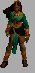
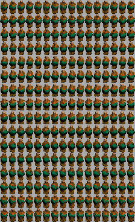
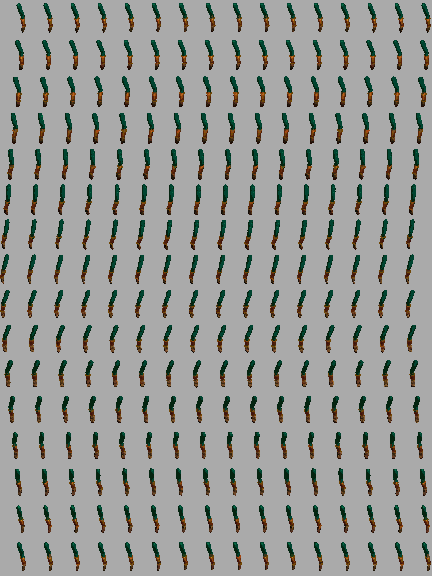
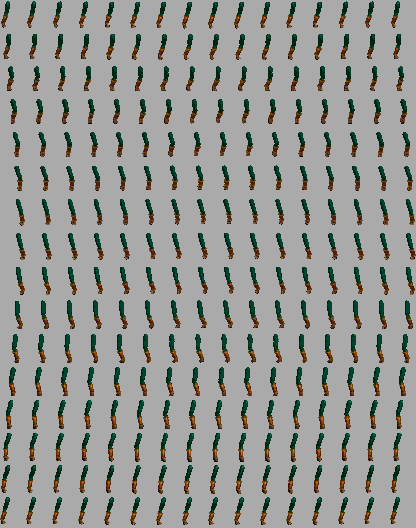

### Diablo 2 SpriteSheet Generator (WIP)

Pequeno script criado para montar um spritesheet a partir de arquivos PCX extraidos do jogo Diablo 2. Esses arquivos são imagens geradas a partir dos arquivos MPQ que o jogo possui.

</img> </img> </img> </img> </img> </img>
