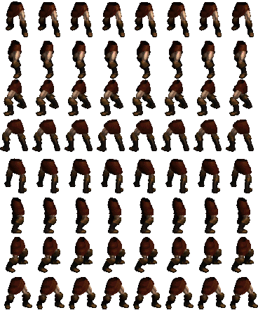

### The script was created to help me study 2.5D RPG games from the 90's and 2000's. It was not created to facilitate or encourage piracy.

Script to automate the extraction of sprites from the game Diablo 2.

For those who don't know, the game Diablo 2, as well as several other games from the 90s~2000s. It uses pre-rendered 3D sprites, separated into several layers. For example, there is a layer for the head, left arm, right arm, legs and torso. When you equip a shield in-game, the left arm layer carries a sprite of the shield you equipped.

For each animation (Idle, Walk, Run, Attack, etc...) there are several pieces that we need to put together to create a complete animation, according to the need (equipped items, character's health status, etc...). The image below best exemplifies this technique:
<br>
<br>
<center></center>
<br>
Within the game files, there are files with the extension .COF. These files have the animations with the layers mounted. From these files we were able to extract the sprites, but to be able to program the exchange of items in the character, we need to extract the sprites from each body part separately. Separated by animation level and equipped items.

### Requirements
 - Tenha o Diablo 2 instalado
 - Python 3.x
 - Python PIP

### How to find the animations to extract the sprites?

To make it easier to preview how the animation should look, I recommend using the tool [MPQ Viewer](https://github.com/collinsmith/riiablo#mpq-viewer). Through it, we can browse the game files and view the sprites.

Animations have a naming rule, you can read about naming on page 12 in this [PDF](https://github.com/collinsmith/riiablo#mpq-viewer). In this example, I will use an animation that can be considered as IDLE.
<br>
<br>
<center></center>
<br>

PATH: data\global\CHARS\SO\COF\SOTN1HT.cof

On this screen, we are going to use the Layers option. Each layer represents a "part" of the character's body. The options in the list on the right are examples of the types of items each layer can use. For example, the LIT option is the basis of every Diablo class. That is, if the HD layer (Head) is with the LIT type, the animation will be of the character without any item equipped for the head. The same rule applies to the other parts of the body.

Now that we have the animation we are going to extract the sprites.

### How to extract the sprites?

Before explaining how the script works, I'll tell you why it was created. To extract the sprites from the game, we use a tool called [Merge DCC](https://d2mods.info/forum/viewtopic.php?t=64449). In it, we configure the animation and the type of layer that we are going to extract. It is a very good tool, however I haven't found a way for it to extract a complete spritesheet for use. It extracts the images into separate files, that is, an animation with 16 directions and 16 sprites generates 256 files. Anyone who works with gamedev knows that a well-assembled spritesheet greatly reduces the work when programming animations. For this reason, I created this script that extracts the sprites, assembles a sprite sheet and removes the background of the images, being ready for use in any engine.

The script is very simple to use, just open the `config.ini` file from the root of the repository and configure the animation and the armor type. Then just run the command:
```bash
python src\main.py
```

The spritesheets will be generated in the `sheets` folder. Ex:
<br>
<br>
<center></center>
<br>

### How to extract an entire sprite?

For a better understanding of how item naming works, read the [PDF](https://github.com/collinsmith/riiablo#mpq-viewer).

In the `config.ini` file, set the item type for each body part. The name of the body parts, follow this image:
<br>
<br>
<center></center>
<br>

The items you can find in the tool [MPQ Viewer](https://github.com/collinsmith/riiablo#mpq-viewer), at the beginning of the readme there is an explanation on how to find them.
```ini
[CONFIG]
ANIMATION=BANU1HS
ARMOR_TYPE=BHM

FULL_SPRITE=1

[BODY_PARTS]
HD=bhm
TR=med
LG=HVY
RA=HVY
LA=HVY
RH=mac
LH=
SH=BSH
S1=HVY
S2=HVY
```
Will produce this:
<br>
<br>
<center></center>
<br>

---
### Project status WIP

- [ ] Projectile Animations
- [ ] UI Sprites
- [x] Full Sprite Animations
- [x] Amazon Animations
- [x] Sorceress Animations
- [x] Necromancer Animations
- [x] Paladin Animations
- [x] Barbarian Animations
- [x] Expansion Animations
    - [x] Druid Animations
    - [x] Assassin Animations
